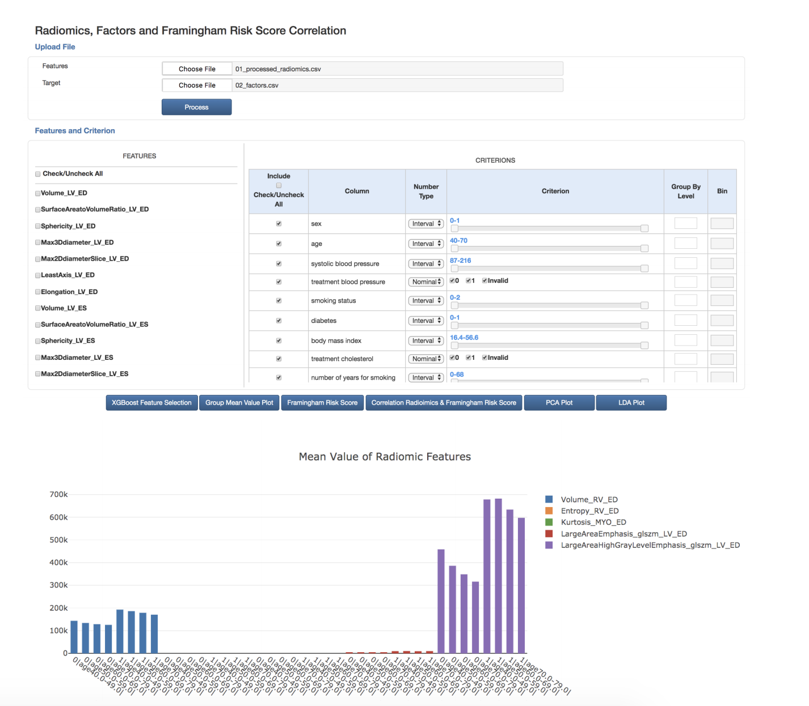
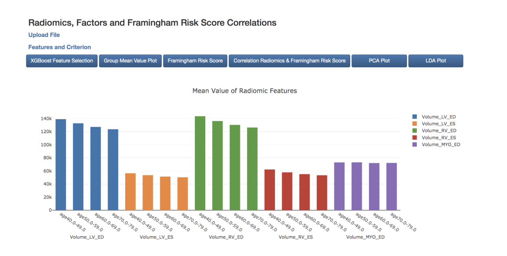

# A computational and visualisation tool for investigating associations between cardiac radiomics, risk factors and clinical data

A machine learning-based web application for analyzing and brining the insights of Clinical Data.

This ML-based web application was developed for helping users to find significant hidden pattern of data in a large dataset which we can't find by naked eyes.
The target dataset used in the findings was clinical data in size of  \~5000x~10,000 values (number of patients x patient's data).
I applied different machine learning algorithms such as PCA, LDA, XGBoost and use their combinations for finding hidden patterns and correlations.

In visualization, I especially focused on data stratification to visualize correlations. The tool shows great results. 
Ex. 
LDA + XGBoost clearly shows clusters disease and their relations.
Age and gender have strong correlation with Radiomic's feature and so on.

## Dynamically generating stratification options based on input datatype

## Example of Stratification Result

## Message
I hope the result of my hard work and limited of time would be useful to anyone who want to contribute your work to our society and help in developing and making healthcare system better. 

For more information: [publish repository](https://repositori.upf.edu/handle/10230/42547)

IDE: Eclipse
Initial setting:
Import project by clicking on File > Open Projects from File System
Right click at the project and select PyDev > Set as Django Project

To run the project, right click on the project then select Django

## Install Django
$ sudo pip install Django

### Start project
$ django-admin.py startproject <project name>
$ python manage.py runserver

## Create a new module
### Change directory to the place where a new module will be created.
$ python manage.py startapp <module name>

### Manually add urls.py, forms.py and serializers.py(optional) inside the module folder.
- Add urls.py, forms.py and and serializers.py into a new module folder	
- Configure config file path to settings.py by adding path to INSTALLED_APP. Ex. data_mgt.apps.DataMgtConfig
- Register a newly created urls.py in the package to urls.py in the config folder.

# Other python command
Install required libraries listed in requirments.txt file.

pip install -r requirements.txt

